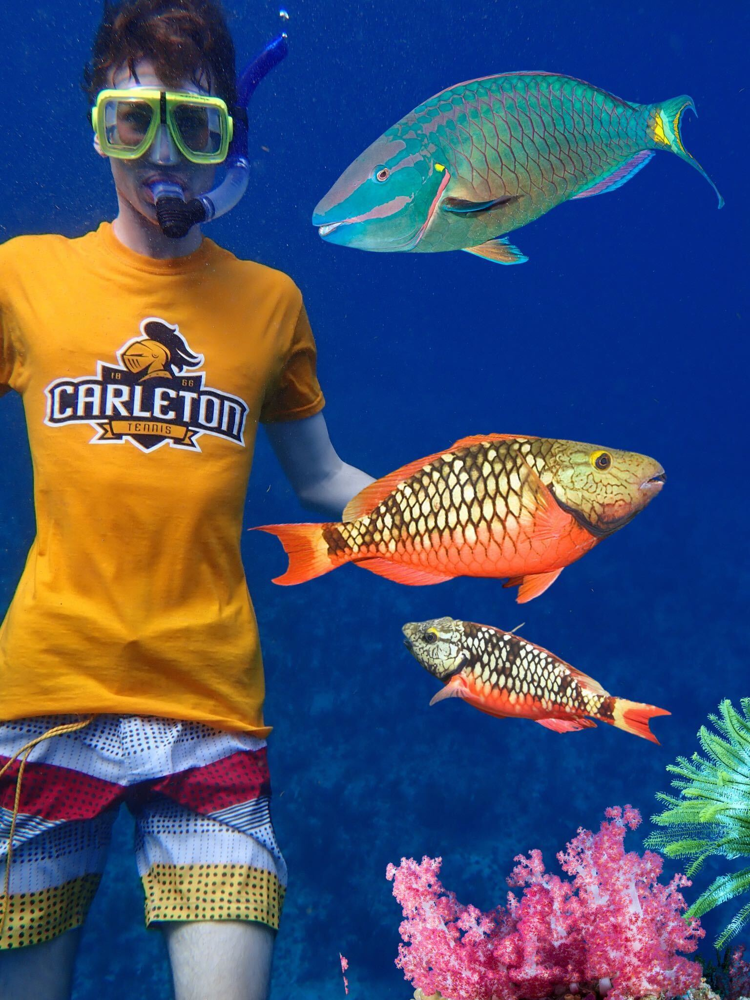
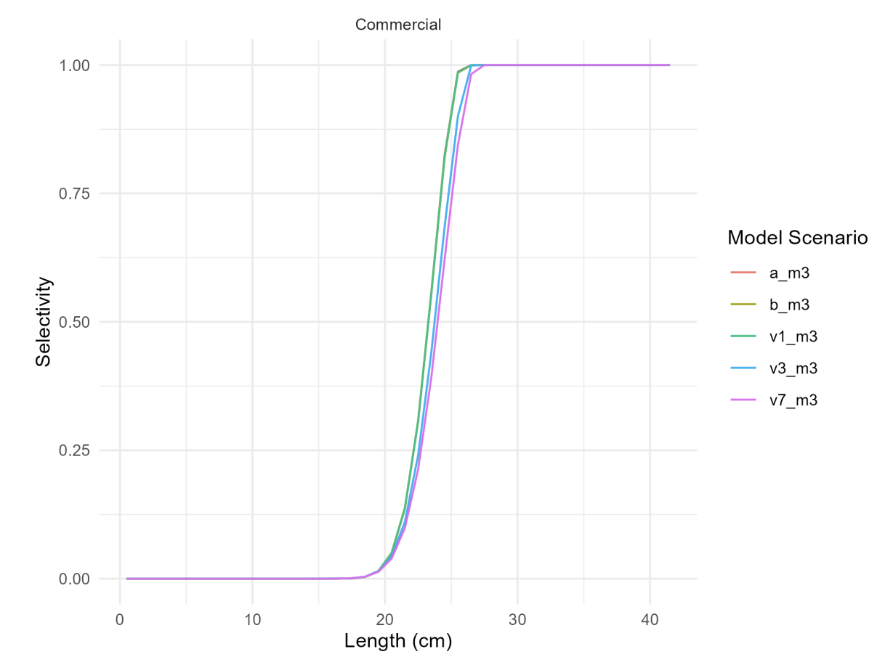

```{r setup, include = FALSE}
knitr::opts_chunk$set(
	message = FALSE,
	warning = FALSE
)
```


This workshop will provide you with an introduction to the [`marlin`](https://danovando.github.io/marlin) package, created by Dan Ovando.

# Prerequisites

We will be using the `marlin` package, which we can install from GitHub using `devtools`.

```{r}
#| eval: false
install.packages("devtools")
devtools::install_github("DanOvando/marlin")
```

Because `marlin` is built using C++ on the back end, there are sometimes installation issues that occur. There are several GitHub issues in the `marlin` repository for troubleshooting this issue, so first see if your error has already been experienced. Otherwise, feel free to add a new issue to the repository. 

Here are some of the install issues with solutions: 

- If you are getting compilation errors or API rate limit errors: see [this issue](https://github.com/DanOvando/marlin/issues/12) and [this issue](https://github.com/DanOvando/marlin/issues/115)
- If you have an Apple M1 chip and are getting a `clang` error: [see issue](https://github.com/DanOvando/marlin/issues/72)
- If you are getting errors about not having the necessary tools to compile a package: [see issue](https://github.com/DanOvando/marlin/issues/106)

If you have a Mac, one of the most sure fire ways to get `marlin` to load is to use [`macrtools`](https://github.com/coatless-mac/macrtools) and run through the following script: 

```{r eval = FALSE}
# install.packages("remotes")
remotes::install_github("coatless-mac/macrtools")

# Remove all rtools first (xcode, gfortran, etc.)
macrtools::macos_rtools_uninstall()

# Re-install all rtools
macrtools::macos_rtools_install()
```

We will also be using `tidyverse`, `sf`, `terra`, and `plot.matrix`.

```{r}
#| eval: false
install.packages(c("tidyverse", "sf", "terra", "plot.matrix"))
```

Let's go ahead and load the relevant packages now. 

```{r}
library(marlin)
library(tidyverse)
library(sf)
library(terra)
library(plot.matrix)
```

# Data gathering 

In this tutorial, we will be modeling the Stoplight Parrotfish (*Sparisoma viride*) population in St. Croix (shout out to Lewis for the species selection!). 

{width="50%"}

`marlin` requires a lot of data and requires you to be diligent in making sure the data you import is accurate and consistent. We're going to spend a lot of time setting up the model, and very little time actually running it! 

Note that `marlin` can easily create a multi-species and multi-fleet model. The world is your oyster, but be aware of potential impacts to processing time.

## Model parameters

We first need to define model parameters. These include: the model region, the model resolution, the model coordinate reference system (CRS), the number of total time steps, and the number of seasons. 

One note about CRS - `marlin` often thinks in terms of square kilometers, so it's best to choose a CRS that allows for measurements in meters (rather than degrees). I found the CRS for this example by Googling the CRS for St. Croix. 

For our example, we will use the following:

```{r}
# Define model region in latitude/longitude
model_region_4326 <- sf::st_bbox(c(xmin = -65.02, xmax = -64.4, 
                              ymin = 17.58, ymax = 17.89), 
                              crs = "epsg:4326")

# Define desired coordinate reference system 
# This should be a crs that allows for measurements in *meters*
crs <- "epsg:8118"

# Define model region using the desired CRS
model_region <- sf::st_transform(model_region_4326, crs = crs)

# Define resolution in meters
spat_resolution <-  5000

# Define total time steps
steps <- 50

# Define total number of seasons; if species showed seasonal differences
# in habitat preference, or aggregated to spawn, we would model more seasons
seasons <- 1
```

From these values, we can define more values that are necessary for `marlin`. These include defining the model area and cell size, and making several templates for the model region (`raster`, `data.frame`). We will do this below by first defining the model area as a raster: 

```{r}
# Define raster
model_raster <- terra::rast(xmin = model_region[["xmin"]], 
                            xmax = model_region[["xmax"]], 
                            ymin = model_region[["ymin"]], 
                            ymax = model_region[["ymax"]], 
                            crs = crs, 
                            resolution = spat_resolution, vals = 1)
```

To make our lives easier down the line, we also want to have a `data.frame` that we can use so that we make sure our latitude/longitudes match perfectly with the matrix x and y IDs. We'll do that below: 

```{r}
# Create a data.frame template as well so that we can convert our 
# x and y cell locations into true coordinates
model_df_template <- model_raster %>% 
  terra::as.data.frame(., xy = TRUE) %>% 
  arrange(x, y)

y_matrix_df <- data.frame(y = model_df_template %>% 
                            distinct(y) %>% 
                            pull(y)) %>% 
  mutate(y_matrix = 1:nrow(.))

x_matrix_df <- data.frame(x = model_df_template %>% 
                            distinct(x) %>% 
                            pull(x)) %>% 
  mutate(x_matrix = 1:nrow(.))

model_df_template <- model_df_template %>% 
  select(x, y) %>% 
  left_join(y_matrix_df) %>% 
  left_join(x_matrix_df)
```

Finally, let's create a list of model parameters, so that we can easily reference it later: 

```{r}
# Return list of model parameters
model_parameters <- list(resolution = rev(dim(model_raster)[1:2]),
                         num_patches_side1 = dim(model_raster)[2], 
                         num_patches_side2 = dim(model_raster)[1], 
                         patches = prod(dim(model_raster)[1:2]), 
                         patch_area_km2 = (spat_resolution/1000)^2,
                         patch_side_km = spat_resolution/1000, 
                         simulation_area_km2 = prod(dim(model_raster)[1:2])*(spat_resolution/1000)^2, 
                         seasons = seasons, 
                         years = steps)
```

We're making this easy on ourselves today and not modeling an area that crosses the antimeridian. That could be it's own tutorial! If you find yourself needing to use `marlin` for a region that crosses the antimeridian, don't hesitate to reach out! I have a ton of code that does just that and will save you a few headaches.

## Spatial layers

Another thing that we'll need to supply are spatial layers - these include fishing grounds, landing sites, and proposed Marine Protected Areas (MPAs). 

We won't be creating landing sites today, but you can follow a similar methodology to add them for your own work. If supplied, `marlin` will use landing sites to calculate costs associated with traveling to/from landing sites and fishers will prioritize areas with high biomass that are closer to landing sites. 

### Fishing grounds

For this example, we will allow fishers to fish within the entire model area, apart from areas that are on land or areas that are in existing MPAs. We supply a `data.frame` to `marlin` of logical fishing areas that correspond to the x and y grid IDs of the model region. 

We can start by reading in our existing MPA and rasterizing the layer of the non-protected areas. I use a subset of data gathered from [MPAtlas](https://mpatlas.org/) that has been saved in our `data/processed` folder. 

```{r}
# Grab existing MPAs, convert to the appropriate CRS, and make valid
existing_mpas <- st_read(here::here("data", "processed", "existing_mpas.gpkg"), 
                         quiet = T) %>%
  st_transform(., crs) %>%
  st_make_valid()

# Create a raster that gives existing MPAs a value of NA and open areas a value of 1
non_mpa_raster <- terra::rasterize(existing_mpas %>% 
                                     st_crop(., model_raster),
                                   model_raster, field = NA, 
                                   background = 1)
```

Now, we can mask the `non_mpa_raster` by the St. Croix land file we have in our `data/processed` folder. 

```{r}
# Read in land 
land <- st_read(here::here("data", "processed", "st_croix_land.gpkg"), 
                quiet = TRUE) %>% 
  st_transform(., crs)

# Mask the non_mpa_raster by land 
fishing_ground_raster <- non_mpa_raster %>% 
  terra::mask(., land, inverse = TRUE)

# Rename the layer for this raster
names(fishing_ground_raster) <- "fishing_grounds"
```

We can convert this into a `data.frame`, which is what `marlin` is looking for in respect to fishing grounds. 

```{r}
# Convert to dataframe
fishing_grounds_df <- as.data.frame(fishing_ground_raster, 
                                    xy = TRUE, na.rm = FALSE) %>%
  left_join(model_df_template) %>%
  mutate(fishing_grounds = ifelse(is.na(fishing_grounds), FALSE, TRUE)) %>%
  select(-x, -y) %>%
  rename(x = x_matrix,
         y = y_matrix)
```

### Proposed MPAs

We can now move on to proposed MPA areas. I've just quickly created a new proposed MPA under the assumption that St. Croix would want to expand a previously-existing MPA. We will use the same methodology we used for the fishing grounds layer: 

```{r fig.cap = "Existing and proposed MPAs in the study region."}
#| echo: false

land_shapefile <- st_read(here::here("data", "processed", "st_croix_land.gpkg"), quiet = T) %>% 
  st_transform(., crs)

existing_mpas <- st_read(here::here("data", "processed", "existing_mpas.gpkg"), quiet = T) %>%
  st_transform(., crs) %>%
  st_make_valid()
  
proposed_mpa <- st_read(here::here("data", "processed", "new_mpa.gpkg"), quiet = T) %>%
  st_transform(., crs) %>%
  st_make_valid() 

ggplot() + 
  geom_sf(data = existing_mpas, mapping = aes(fill = "Existing MPA")) + 
  geom_sf(data = land_shapefile, fill = "white") + 
  geom_sf(data = proposed_mpa, mapping = aes(fill = "Proposed MPA"), 
          color = "black", linetype = "dashed") + 
  scale_fill_manual("", values = c("Existing MPA" = "gray", "Proposed MPA" = "white")) + 
  theme_void() +
  theme(legend.position = "bottom")
```


```{r}
proposed_mpa <- st_read(here::here("data", "processed", "new_mpa.gpkg"), quiet = T) %>%
  st_transform(., crs) %>%
  st_make_valid() 

proposed_mpa_raster <- terra::rasterize(proposed_mpa %>% 
                                     st_crop(., model_raster),
                                   model_raster, field = 1, background = NA)
names(proposed_mpa_raster) <- "mpa"

proposed_mpa_df <- as.data.frame(proposed_mpa_raster, xy = TRUE, na.rm = FALSE) %>%
  left_join(model_df_template) %>%
  mutate(mpa = ifelse(is.na(mpa), FALSE, TRUE)) %>%
  select(-x, -y) %>%
  rename(x = x_matrix,
         y = y_matrix)
```

## Fish parameters

Now that we have our overall model parameters completed, we'll need to define some fish parameters. These include: 

- Life-history characteristics of the model species
- An idea of movement for the model species
- Spatial habitat preference or abundance layers for the model species

Each of these will take some time, effort, and lots of coffee (or tea). 

### Life-history characteristics 

Let's dig into the life-history characteristics. In an ideal world, we would be able to find all the life-history characteristics of our model species from a recent stock assessment in the region of interest. We know that's not always possible, so we will work with what we have and `marlin` can help us if we get stuck. In the back-end, `marlin` uses the [`FishLife`](https://james-thorson-noaa.github.io/FishLife/) package to fill any life-history parameters that we may be missing. Beware, though, as this can create some "frankenfish" if we're not careful. We want to make sure that the life-history values that are supplied are consistent in both units and spatial origin (something that  `FishLife` doesn't check for when pulling data). If we can't find estimates that match perfectly, we should try to find estimates from studies with similar methods in nearby regions. 

For this example, I've grabbed the relevant life-history characteristics for Stoplight Parrotfish that are referenced in the [US Caribbean Stoplight Parrotfish – St. Croix Assessment Report](https://caribbeanfmc.com/images/General%20Archive/SSC/2025-sep/SEDAR%2084%20US%20Caribbean%20Yellowtail%20Snapper%20STX%20Final%20Stock%20Assessment%20Report%20-%20August%202025%20(1).pdf) (SEDAR 2025). Many of these values originated from [Shervette et al., (2024)](https://sedarweb.org/documents/sedar-84-dw-08-u-s-caribbean-yellowtail-snapper-population-demographics-growth-and-reproductive-biology-addressing-critical-life-history-gaps/). The assessment report has results from several models, so we will use values from the most comprehensive model listed in the report (m3 v7, a model that includes hermaphroditism, adjusted age at t0, continuous recruitment, and catch uncertainty and includes fishery-independent length data and recruitment deviations). Note that for simplicity, this `marlin` run does not account for hermaphroditism; if you're modeling a hermaphroditic species or a sexually dimorphic species, you would probably want to build two separate species models - one for males and one for females.

```{r}
# Define life-history characteristics, take note of the units and the source
lh <- list(
  linf = 33.8, # mm converted to cm fork length from Shervette et al., 2024
  vbk = 0.33, # unitless from Shervette et al., 2024
  t0 = -0.52, # unitless from Shervette et al., 2024
  max_age = 20, # years from SEDAR 2025
  weight_a =  3.18e-5, # for weight in kg and length in cm, from SEDAR 2025
  weight_b = 2.90, # for weight in kg and length in cm, from SEDAR 2025
  length_50_mature = 15.3, # mm converted to cm fork length from Shervette et al., 2024
  age_50_mature = 1.6, # years from Shervette et al., 2024
  m = 0.27, # from SEDAR 2025
  steepness = 0.99, # from SEDAR 2025 
  r0 = 4.61*1000, # mt converted to kg, from SEDAR 2025 
  ssb0 = 37.67*1000, # mt converted to kg, from SEDAR 2025
  fished_depletion = 0.74 # from SEDAR 2025
)
```

We define as many life history variables as we can above, but note that there are many more that we could provide if we had the data. See `?Fish` for a full list of parameters.

### Species movement - home range 

Next, we need to find an appropriate home range for the species. We can often find this in the literature from telemetry studies. `marlin` uses home range to predict a "diffusion" rate, or an average distance that an animal is expected to move over one time step. `marlin` can account for species movement in three ways 1) "taxis", or the direct movement from less preferred habitats to more preferred ones (derived from the habitat matrix that we'll supply later), 2) "diffusion" (derived from the home range parameter), and 3) "advection", or movement associated by drifting with the currents. Advection is currently set to 0 in this version of `marlin`. Notice that the diffusion parameter should not include directed movements to preferred habitats - when we're searching the literature for a home range, we want to make sure that the value we use was not calculated from individuals that were translocated (moved to a different site to see if they would return to their capture location) or that were undergoing migrations to/from habitats for activities like spawning. Another important thing to note is that the home range that `marlin` is actually a *linear distance*, and most reported home ranges are *areas*. When we add the home range value to `marlin`, we need to make sure that it has the same units as our model area (here, km) and is a linear distance (the square root of a reported home range area).

After a quick search of Google Scholar, I was unable to find a home range estimate for Stoplight Parrotfish in La Croix. I did, however, find estimated territory ranges of Stoplight Parrotfish in the Florida Keys. While not ideal, we can use this estimate as a starting point to get `marlin` running. If we were to use this for a real research project, we would probably want to run a sensitivity analysis with different home range values to see how much our results would change if our selected home range was wrong.

[Smith et al., (2023)](https://link.springer.com/article/10.1007/s10641-023-01394-1#Sec6) find that some Stoplight Parrotfish had territory sizes up to 282.6 $m^2$, so we'll use that value for now. We want to make sure that the home range we supply is a linear distance and is the same units that we use for our model region (km). 

```{r}
home_range <- sqrt(282.6)/1000
```

### Habitat preferences

Finding appropriate habitat layers starts getting a little tricky, but there are many ways to find something that works. Ideally, you will have a heatmap of occurrence for the species of interest in your model region and you will be able to directly pull the data and use it as a habitat layer. Other suitable options include: if you have geospatial catch data - you can assume that areas where catch is highest are preferred habitats (though this also assumes fishers have perfect knowledge of biomass), if you have habitat data and you know your species favors particular habitats - you can assume distances further away from the habitat of interest have lower biomass. 

For this example, we know Stoplight Parrotfish are reef-associated. So, we pulled reef location data from the [Allen Coral Atlas](https://allencoralatlas.org/), rasterized the data using our model region parameters, and calculated distances for each cell from the reef. We then standardized values between 0 and 1, where values of 1 are close to or on top of the reef and values of 0 are furthest away from the reef. Land areas are NAs. It's very important that land is represented as NA, as NA indicates the animal *cannot* go to that area, while 0 indicates that the animal could theoretically swim through the area, but does not prefer it.

Note that our habitat layer that is saved in `data/processed` is already in the proper CRS and resolution for our model region. This is not the norm; you'll usually have to reproject and resample the data to make sure it matches our model parameters.

```{r}
# Load in the habitat dataframe
habitat_df <- read.csv(here::here("data", "processed", "habitat_suitability.csv"))

# Convert to raster
habitat_raster <- terra::rast(habitat_df, type = "xyz", crs = crs)

# Convert to matrix 
habitat_matrix <- matrix(habitat_df %>% 
                           arrange(x, desc(y)) %>% 
                           pull(habitat_suitability), 
                         ncol = dim(habitat_raster)[2], 
                         nrow = dim(habitat_raster)[1])
```

Now, we want to make sure that the way our data go into `marlin` are the way that `marlin` expects them. We can test this by plotting the matrix using `plot.matrix` and the `data.frame` version of the matrix joined to the x and y cell locations. 

```{r fig.cap = "The raster output showing the preferred habitats of Stoplight Parrotfish."}
# Test our outputs - this should be the same orientation that we would see on something like Google Maps
terra::plot(habitat_raster, type = "interval")
```

```{r fig.cap = "The matrix output showing the preferred habitats of Stoplight Parrotfish."}
# Test our matrix - this should match how our raster plot looks
plot(habitat_matrix)
```

```{r fig.cap = "The data.frame output showing the preferred habitats of Stoplight Parrotfish."}
# Test against our dataframe - using the x and y grid cell ids 
habitat_df %>% 
  left_join(model_df_template) %>% 
  mutate(binned_suitability = round(habitat_suitability/0.2)*0.2) %>% 
  ggplot() + 
  geom_tile(mapping = aes(x = x_matrix, y = y_matrix, 
                          fill = binned_suitability)) + 
  coord_sf() 
```
The orientation seems right in each of these plots!

One fun thing to note here is that `marlin` does allow for the incorporation of climate change via multiple habitat layers (one per step). So, if you have the data handy, you can provide `marlin` with a list of habitat matrices for each projected time step. See the [Set Dynamic Habitats](https://danovando.github.io/marlin/articles/dynamic-habitat.html) vignette for more information. 

### Create the `fauna` object

Now we can create our `fauna` object for `marlin`. Here, we specify all the life-history characteristics, movement data, and habitat preferences. One important thing to note here is that if we *don't* have separate habitat matrix layers for adults and recruits to the fishery, we need to specify the habitat matrix that we have for both the adults and the recruits, otherwise `marlin` will let recruits spawn on land and then they will get stuck there (sad recruits). 

```{r}
fauna <- list("stoplight" = create_critter(scientific_name = "sparisoma viride", 
                                           adult_home_range = home_range, 
                                           habitat = habitat_matrix, 
                                           recruit_habitat = habitat_matrix,
                                           density_dependence = "local_habitat", 
                                           linf = lh$linf,
                                           vbk = lh$vbk,
                                           t0 = lh$t0,
                                           max_age = lh$max_age,
                                           weight_a =  lh$weight_a,
                                           weight_b = lh$weight_b,
                                           length_50_mature = lh$length_50_mature,
                                           age_50_mature = lh$age_50_mature,
                                           m = lh$m,
                                           steepness = lh$steepness,
                                           r0 = lh$r0,
                                           ssb0 = lh$ssb0,
                                           fished_depletion = lh$fished_depletion, 
                                           resolution = model_parameters$resolution, 
                                           patch_area = model_parameters$patch_area_km2))
```

We can check that our `fauna` object looks okay by plotting our values at age: 

```{r fig.cap = "Fauna values at age."}
fauna$stoplight$plot()
```

We can also look at the movement plots for our defined `fauna`: 

```{r fig.cap = "Movement of post-recruits and recruits."}
fauna$stoplight$plot_movement()
```

Here, we can see that the post-recruits (adults) in the fishery typically stay their starting position, which matches well with what we would expect for a reef-associated species with a small home range. For the recruits, "movement" relies on density dependence. The recruit plot shows the proportion of the total number of recruits that are in each cell. In our example, these values are very small so they all look like 0s when the color scale ranges from 0-1. We can plot this by itself if we're curious, but it should look similar to the habitat layer we provide, since the habitat layer is what is used to spatially distribute the number of recruits. 

```{r fig.cap = "Rescaled recruit movement plot, which is essentially the spatial distribution of recruits and is dependent on the habitat matrix that is supplied."}
model_df_template %>% 
  mutate(r0s = fauna$stoplight$r0s, 
         r0s_scaled = r0s/sum(r0s)) %>% 
  ggplot() + 
  geom_tile(mapping = aes(x = x_matrix, y = y_matrix, fill = r0s_scaled)) + 
  scale_fill_viridis_c() + 
  labs(fill = "Proportion of recruits") + 
  coord_sf() + 
  theme_void() + 
  theme(legend.position = "bottom", 
        legend.title = element_text(vjust = 0.8), 
        legend.text = element_text(angle = 45, hjust = 1))
```


## Fleet parameters

### Fleet selectivity

Fishing for Stoplight Parrotfish in St. Croix can be done via spearfishing, by hand via diving, or by pots and traps. The stock assessment report does not differentiate between these "commercial" fisheries, so we will not either. The assessment report provides selectivity curves for each model that they ran for the "commercial" fishery:



`marlin` allows you to enter selectivity at age parameters for dome-shaped, logistic, or double-normal curves. However, I find it easier to supply a manual selectivity curve so that I'm sure `marlin` interprets the selectivity parameter the way I want it to. I used ImageJ to grab the x and y coordinates for the selectivity curves presented in SEDAR (2025) and saved them to our `data/processed` folder. We can read them in now. 

```{r}
selectivity <- read.csv(here::here("data", "processed", "selectivity_curve.csv")) %>% 
  rename(length_cm = X, 
         selectivity = Y)
```

To convert this into a selectivity curve `marlin` can understand, we want to create a smoothed line from our point estimates, so that we can select any x coordinate and retrieve a y value. We can do this by using `smooth.spline()`: 

```{r}
smoothed_selectivity <- smooth.spline(selectivity$length_cm, 
                                      selectivity$selectivity, 
                                      spar = 0.10)
```

Let's take a look at this selectivity curve to make sure it matches the one from SEDAR (2025) by predicting every length between 0 and 40 cm: 

```{r}
predict_all_lengths <- predict(smoothed_selectivity, 0:40)

ggplot() +
  geom_line(mapping = aes(x = predict_all_lengths$x, 
                          y = predict_all_lengths$y)) + 
  labs(x = "Length (cm)", y = "Selectivity")
```
That looks pretty close! 

Now, the selectivity curve from SEDAR (2025) is for *lengths*, but `marlin` thinks about selectivity by *age*. So we'll have to pull selectivity values for the lengths that correspond to each age class in our `fauna` object. We can do this by predicting selectivity values across `fauna$stoplight$length_at_age`: 

```{r}
selectivity_values <- predict(smoothed_selectivity, 
                              fauna$stoplight$length_at_age)[["y"]]
```

We also want to make sure that the selectivity values don't go beyond 0 and 1 (this could happen if I clicked a little bit too high/low on the curve in ImageJ), so we can manually adjust those values here: 

```{r}
selectivity_values[(selectivity_values < 0) | is.na(selectivity_values)] <- 0
selectivity_values[(selectivity_values > 1)] <- 1
```

If we wanted to model many species or many fisheries, we would need selectivity curves for each species and fishery combination. 

### Relative exploitation rate

We also need to supply a relative exploitation rate (`p_explt`) for each species that a fleet targets. When we're only modeling one species and one fleet, `p_explt` = 1. However, when multiple fleets target the same species, we would need to think about our `p_explt` values. For example, if fleet A and fleet B are both fishing for Stoplight Parrotfish, but fleet A is responsible for 2/3 of the total catch of the species, reasonable `p_explt` values would be 2 for fleet A and 1 for fleet B. The best way to figure out which `p_explt` values to use would be to find landings data and calculate the relative contribution of each fleet to a species' total landings. If a species is caught as bycatch, `p_explt` can be 0.

We'll use a `p_explt` of 1 for our example: 

```{r}
p_explt <- 1
```

### Landing price

We also need to specify a price per species, so that a fleet that targets multiple species knows which species to prioritize catching. For example, if a fleet targets 3 species, but would rather catch species A because it's more valuable, the price for that species should be higher than the price for others. The best way to find these values is by looking up ex-vessel prices for each of the species you're modeling (ideally specific to the model region). Just make sure that the price is relative to the units that you've used for your `fauna` parameter. Since we've specified values in kg, we would want our price to be in USD/kg. 

[Callwood et al., (2021)](https://www.sciencedirect.com/science/article/pii/S2351989421002274) report that parrotfish in the Bahamas can sell for 2.21 to 44.09 USD per kg. We'll choose a value in the middle - 18 USD/kg. 

```{r}
price <- 18
```

### How should our fleet respond to management changes

Finally, we have to decide how our fleet should respond to changes in management. This includes:

- What happens when an MPA is implemented? Do fishers stay in the fishery and redistribute to the open fishing areas? Or do they leave the fishery? 
- How do we expect fishers to fish? Is this an open access situation, or constant effort until something changes? 
- How should fishers distribute themselves spatially? Should it be by revenues from catch? Profits? Revenues per unit effort? Profits per unit effort? 

For this example, we make the following decisions: 

- If an MPA is implemented, fishers will **leave** and their effort will be removed from the study area. 
- We expect fishers to fish under **constant effort** (until a management change takes place). Dan warns against using open access unless it's absolutely necessary because it adds more levels of complexity that make interpreting results more difficult. Note that if you do choose to use open access, you will have to determine whether your fishery is currently in equilibrium and set the cost-to-revenue ratio (`cr_ratio`) as appropriate.
- We expect fishers to spatially distribute based on **revenues**. 

### Create the `fleet` object

Now we have all the components we need to build our `fleet` object. Let's build it using `create_fleet()`: 

```{r}
fleet <- list(
  "commercial" = create_fleet(
    metiers =
      list(
        "stoplight" = Metier$new(
          critter = fauna$stoplight, 
          price = price, 
          sel_form = "manual", 
          sel_at_age = selectivity_values, 
          p_explt = p_explt)), 
    mpa_response = "leave", 
    fleet_model = "constant effort",
    spatial_allocation = "revenue",
    resolution = model_parameters$resolution, 
    patch_area = model_parameters$patch_area_km2, 
    fishing_grounds = fishing_grounds_df
  )
)
```

Once the fleet is created, we need to tune it. We will have `marlin` tune the fleet to meet the depletion level that we supplied in the `fauna` object. If we specified an initial exploitation rate in our `fauna` object, we could tune it to that instead by setting `tune_type` to "explt". 

```{r}
tuned_fleet <- marlin::tune_fleets(fauna = fauna, 
                                   fleets = fleet,
                                   tune_type = "depletion")
```

Phew! Ok, now we have all of our components ready to run the model! 

# Running the model

We can start by running a business as usual (BAU) model. First, we want to make sure that we're incorporating any existing management measures in our BAU model and in our MPA model. SEDAR (2025) mentions that there is an annual catch limit of 72,365 lbs (~32,824 kg). This is actually spread across two parrotfish species, but we'll just keep it as is for now since we don't know what proportion of total catch the Stoplight Parrotfish make up. We can specify this in our model using the `manager` argument in `simmar()`. Creating a model in `marlin` requires to parts: first `simmar()` creates the simulation, then `process_marlin()` processes the results so that we can better understand them. We do both below for BAU: 

```{r}
# BAU model run
sim_bau <- simmar(fauna = fauna, 
                  fleets = tuned_fleet, 
                  years = model_parameters$years, 
                  manager = list(quotas = list(stoplight = 32824)))

processed_bau <- process_marlin(sim = sim_bau, 
                                time_step = 1, # fraction of a year per step
                                keep_age = FALSE) # aggregate all ages in results 
```

Now, for our MPA model, we want to add an MPA to the `manager` argument and decide in which year the MPA is implemented. Note that because `marlin` is created in the back-end by C++, `marlin` uses 0-indexing, but we (and R) intuitively use 1-indexing. So, if we want an MPA implemented in year 5 of the model, we need to tell `marlin` to actually implement it in year 6. 

```{r}
# MPA is implemented in year 5
sim_implemented <- simmar(fauna = fauna, 
                          fleets = tuned_fleet, 
                          years = model_parameters$years, 
                          manager = list(quotas = list(stoplight = 32824), 
                                         mpas = list(locations = proposed_mpa_df, 
                                                     mpa_year = 6)))

processed_implemented <- process_marlin(sim = sim_implemented, 
                                        time_step = 1, # fraction of a year per step
                                        keep_age = FALSE) # aggregate all ages in results 
```

# Analyzing results

Now that we've run our model, we can start looking at the outputs. `marlin` has some nifty plot functions that we can use, but let's first take a look at what the outputs look like, so that we know how to make our own plots from scratch if we want to. We'll use the BAU run as an example: 

```{r}
processed_bau
```

Our output is a list, with `tibbles` for `fauna` (which includes species-, patch-, and year-level values of number of individuals, biomass, spawning stock biomass, and catch) and `fleets` (which includes species-, fleet-, patch-, and year- level values for catch, revenue, effort, and catch per unit effort). Note that these outputs are the sums of all age classes because used `keep_age = FALSE` in the `process_marlin()` above. 

Now we can jump into using `plot_marlin()` to see some outputs of these results. 
 
First, let's check our spatial results at year 1 - they should look identical. They should show no catch in existing MPAs and catch proportional to the habitat matrix otherwise:

```{r fig.cap = "Spatial `marlin` output for catch (kg) from our BAU and MPA-implemented model runs at year 1."}
plot_marlin('BAU' = processed_bau, 'Implemented' = processed_implemented, 
            plot_var = "c", 
            plot_type = "space", 
            steps_to_plot = 1, 
            max_scale = FALSE) + 
  coord_sf()
```

Now again at year 30 - they should look different now. The BAU result should look the same as the results for year 1, but the MPA scenario should show no catch in the newly proposed MPA area: 

```{r fig.cap = "Spatial `marlin` output for catch (kg) from our BAU and MPA-implemented model runs at year 30."}
plot_marlin('BAU' = processed_bau, 'Implemented' = processed_implemented, 
            plot_var = "c", 
            plot_type = "space", 
            steps_to_plot = 30, 
            max_scale = FALSE) + 
  coord_sf()
```

We can also use `plot_marlin()` to get time series plots. Let's look at catch over time: 

```{r fig.cap = "Catch (kg) of Stoplight Parrotfish over time, under BAU and after an MPA is implemented in year 5."}
plot_marlin('BAU' = processed_bau, 'Implemented' = processed_implemented, 
            plot_var = "c", 
            max_scale = FALSE) + 
  geom_vline(xintercept = 5, linetype = "dashed")
```
These results look a little wonky, but we will come back to that. Let's also look at spawning stock biomass over time: 

```{r fig.cap = "Spawning stock biomass (kg) of Stoplight Parrotfish over time, under BAU and after an MPA is implemented in year 5."}
plot_marlin('BAU' = processed_bau, 'Implemented' = processed_implemented, 
            plot_var = "ssb", 
            max_scale = FALSE) + 
  geom_vline(xintercept = 5, linetype = "dashed")
```

These results are a little wonky too, we see that catch (and spawning stock biomass) both start really high, which leads to a population crash. The population then begins to recover/stabilize as catch rates flatted out at a lower level. We see this in both the BAU and the MPA scenarios, which is a bit of a red flag. For our example, we assume that the state of the fishery is in equilibrium under BAU - which means we expect our BAU lines to be incredibly stable. We discuss how to achieve this in the next section. 

Before we get into that, we will often want to use this as a means to see how total revenues change with the implementation of on MPA. This isn't something that we can plot using `plot_marlin()`, so let's plot it manually below. For this model run, since we didn't specify landing sites, `marlin` calculates revenues as the product of catch and the supplied price variable. 

```{r fig.cap = "Total revenue per year over time, under BAU and after an MPA is implemented in year 5."}
revenues <- processed_bau$fleets %>% 
  mutate(model = "BAU") %>% 
  bind_rows(processed_implemented$fleets %>% 
              mutate(model = "Implemented")) %>% 
  group_by(year, model) %>% 
  summarise(total_revenue = sum(revenue, na.rm = T)) %>% 
  ungroup() 

ggplot() + 
  geom_line(data = revenues, 
            mapping = aes(x = year, y = total_revenue, color = model), 
            linewidth = 2) +  
  scale_color_manual(values = c("BAU" = "black", "Implemented" = "gray")) + 
  geom_vline(xintercept = 5, linetype = "dashed") + 
  labs(color = NULL, 
       x = "Year", 
       y = "Total revenue (USD)") + 
  scale_y_continuous(limits = c(0, NA), labels = scales::comma) + 
  theme_marlin() + 
  theme(legend.position = "top")
```

Ok ok, enough crazy results. Let's make these make more sense.

# Adjusting the model to meet starting equilibrium conditions

We want our BAU model to be stable over time. One way to achieve this is by adding a manual "burn in" period, under which time models are allowed to stabilize before an MPA is implemented. To do this, we will essentially run the model for additional years and discard the years that we designate as "burn in" years. The population under BAU began to stabilize around year 40 in the above example, so we'll add that many additional years to our model. 

```{r}
burn_years <- 40
```

We will now re-run our model using the adjusted time periods: 

```{r}
# BAU model run
sim_bau <- simmar(fauna = fauna, 
                  fleets = tuned_fleet, 
                  years = burn_years + model_parameters$years, 
                  manager = list(quotas = list(stoplight = 32824)))

processed_bau <- process_marlin(sim = sim_bau, 
                                time_step = 1, # fraction of a year per step
                                keep_age = FALSE) # aggregate all ages in results 

# MPA is implemented in year 5
sim_implemented <- simmar(fauna = fauna, 
                          fleets = tuned_fleet, 
                          years = burn_years + model_parameters$years, 
                          manager = list(quotas = list(stoplight = 32824), 
                                         mpas = list(locations = proposed_mpa_df, 
                                                     mpa_year = burn_years + 6)))

processed_implemented <- process_marlin(sim = sim_implemented, 
                                        time_step = 1, # fraction of a year per step
                                        keep_age = FALSE) # aggregate all ages in results 
```

And then re-classify our years in the outputs: 

```{r}
processed_bau <- purrr::map(.x = 1:length(processed_bau), 
                            .f = ~processed_bau[[.x]] %>% 
                              mutate(year = year - burn_years, 
                                     step = step - burn_years) %>% 
                              filter(year >= 0))

names(processed_bau) <- c("fauna", "fleets")

processed_implemented <- purrr::map(.x = 1:length(processed_implemented), 
                            .f = ~processed_implemented[[.x]] %>% 
                              mutate(year = year - burn_years, 
                                     step = step - burn_years) %>% 
                              filter(year >= 0))

names(processed_implemented) <- c("fauna", "fleets")
```

We can now re-make the figures from before: 

```{r fig.cap = "Catch (kg) of Stoplight Parrotfish over time, under BAU and after an MPA is implemented in year 5."}
plot_marlin('BAU' = processed_bau, 'Implemented' = processed_implemented, 
            plot_var = "c", 
            max_scale = FALSE) + 
  geom_vline(xintercept = 5, linetype = "dashed")
```


```{r fig.cap = "Spawning stock biomass (kg) of Stoplight Parrotfish over time, under BAU and after an MPA is implemented in year 5."}
plot_marlin('BAU' = processed_bau, 'Implemented' = processed_implemented, 
            plot_var = "ssb", 
            max_scale = FALSE) + 
  geom_vline(xintercept = 5, linetype = "dashed")
```

We now have results that look much more stable under BAU, and there's a clear change to both catch and spawning stock biomass when the MPA is implemented. We can look at our revenue results again: 

```{r fig.cap = "Total revenue per year over time, under BAU and after an MPA is implemented in year 5."}
revenues <- processed_bau$fleets %>% 
  mutate(model = "BAU") %>% 
  bind_rows(processed_implemented$fleets %>% 
              mutate(model = "Implemented")) %>% 
  group_by(year, model) %>% 
  summarise(total_revenue = sum(revenue, na.rm = T)) %>% 
  ungroup() 

ggplot() + 
  geom_line(data = revenues, 
            mapping = aes(x = year, y = total_revenue, color = model), 
            linewidth = 2) +  
  scale_color_manual(values = c("BAU" = "black", "Implemented" = "gray")) + 
  geom_vline(xintercept = 5, linetype = "dashed") + 
  labs(color = NULL, 
       x = "Year", 
       y = "Total revenue (USD)") + 
  scale_y_continuous(limits = c(0, NA), labels = scales::comma) + 
  theme_marlin() + 
  theme(legend.position = "top")
```